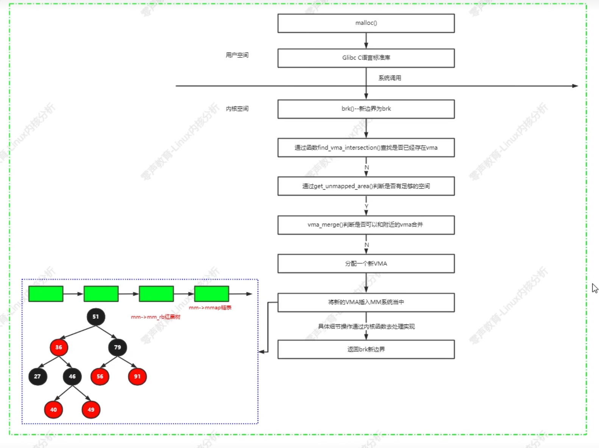

# 剖析linux内核

[参考视频](https://www.bilibili.com/video/BV1SP41177mK?p=12&spm_id_from=pageDriver&vd_source=6b48595092f05a0fc1d129f83872951f)
## 一、内存管理框架
### 常见问题：
        1、页面分配器是按照什么方向来扫描zone？
        2、slab分配器是如何分配和释放小内存块？
        3、私有映射和共享映射的区别？
        4、匿名页面和page cache页面区别？
        5、kswapd内核线程什么时候被唤醒？

        内存管理：物理内存、虚拟内存、页表映射、内核内存布局、分配物理页面、slab分配器、vmalloc、VMA操作、反向映射RAMP、回收页面、匿名页面生命周期、页面迁移、内存规整、KSM等  
### brk系统调用：
    1、在32位linux内核当中，每个用户进程拥有3GB的虚拟空间，内核如何为用户来划分3GB的虚拟空间？
        用户进程内存空间布局架构视图如下：
        用户进程的用户栈从3GB虚拟空间的顶部开始，由顶向下延伸，而brk分配的空间是从数据段顶部到用户栈底部。
        brk系统调用 -> mm_populate -> __mm_populate

### malloc函数实现流程

### get_user_pages()原理分析
        此函数将用户空间的虚拟内存空间传输到内核空间，内核空间为其分配物理内存并建立相应的映射关系。

### mmap()原理/缺页中断处理
        mmap/munmap接口是用户空间最常用的一个系统调用接口，不管是用户程序分配、读写大文件、链接动态库文件等，还是多进程间共享内存。mmap函数原型如下：
        共享内存方式：使用普通文件提供的内存映射；
        使用特殊文件提供匿名内存映射。 
        void *mmap(void *addr, size_t len, int prot, int flags, offt_t offset)
        int munmap(void *addr, size_t len)
        int msync(void *addr, size_t len, int flags)
        一般情况下，进程在映射空间的对共享文件的内容改变并不直接写回磁盘文件，在调用munmap()之后才执行此操作。可以调用msync()实现磁盘上文件内容与共享内存区的内容一致。
        匿名映射（映射类型为私有映射：私有域名映射 -> 用于内存分配。映射类型为共享：共享匿名映射：用于进程之间的共享内存）
        文件映射（映射类型为私有映射--用于加载动态库。映射类型为共享映射，用于内存映射IO，进程间通讯）
        共享文件映射应用场景：进程间通讯，读写文件。

        缺页中断处理：