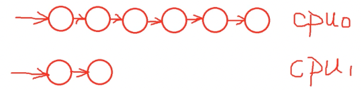

# cpu负载计算

## 一、如何衡量一个cpu负载
        1、cpu负载？（系统负载，就是任务队列平均长度）
        2、案例分析：双核处理器，cpu0就绪队列里面有6个进程，cpu1就绪队列里面有2个进程。 
        由于cpu0就绪队列有6个进程，很明显比cpu1就绪队列里面进程数量要多，所以得出cpu0比cpu1的负载更大。cpu负载等于就绪队列的总权重。

## 二、工作及量化负载
        1、现在有一个cpu，有4个进程，内核调度器（每个进程分配1min）。调度器如何判断哪个进程是cpu重度使用者？
        cpu负载 = （运行时间 / 总时间）* 就绪队列总权重。
        运行时间：就绪队列占用cpu总时间；
        总时间：采样的总时间（空闲状态时间和cpu执行时间）；
        权重：就绪队列里面所有进程的权重。
    
        linux内核进程负载计算不仅考虑权重，而且跟踪每个调度实体的历史负载，此算法为PELT算法。案例分析：把1ms时间跨度算为一个周期（PI）.一个调度实体在PI内对工作负载的贡献和如下因素有关：
        1、进程权重；
        2、PI内可运行的时间的衰减累计值；
        

